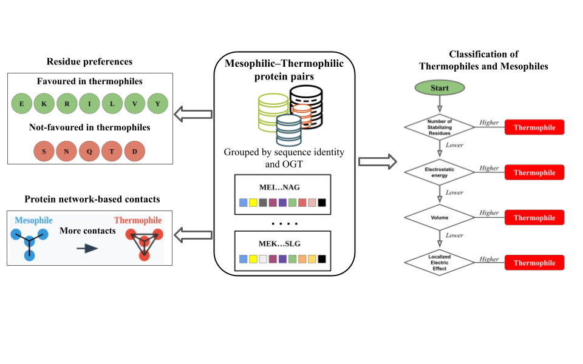

# Thermo-Stable
# Integrating sequence, structure, and graph-based features for elucidating the stability of thermophilic proteins


## Prerequisites
This repository requires the **FoldX** executable to run the `run_classifier` script.

### Steps to Setup FoldX

1. **Download FoldX**  
   Get the valid FoldX executable from the official website: [FoldX Suite](https://foldxsuite.crg.eu/).

2. **Place the Executable**  
   Copy the downloaded FoldX file into the same folder where `run_classifier.py` is located.

3. **Rename the Executable**  
   Ensure the FoldX file is renamed to `foldx` exactly (case-sensitive).

4. **Give Executable Permissions**  
   Run the following command to make it executable:
   ```bash
   chmod +x foldx

### Setup Rate4Site

#### Option 1: Manual Download

1. Go to the ConSurf GitHub repository: [https://github.com/Rostlab/ConSurf](https://github.com/Rostlab/ConSurf)  
2. Click the green **Code** button and select **Download ZIP**.  
3. Extract the downloaded ZIP file.  
4. Copy all the contents from the extracted folder into your existing `Rate4Site` folder.  
   - Example:
     ```bash
     cp -r /path/to/ConSurf-master/* /path/to/Rate4Site/
     ```

#### Option 2: Using Git

1. Navigate to your `Rate4Site` folder:
   ```bash
   cd /path/to/Rate4Site

`git clone https://github.com/Rostlab/ConSurf.git temp_ConSurf`

## Usage
`python3 run_classifier.py <protein1.pdb> <protein2.pdb>` 

Make sure both protein1.pdb and protein2.pdb in the same folder of run_classifier,py code.

### Example 
`python3 run_classifier.py example1.pdb example2.pdb`


